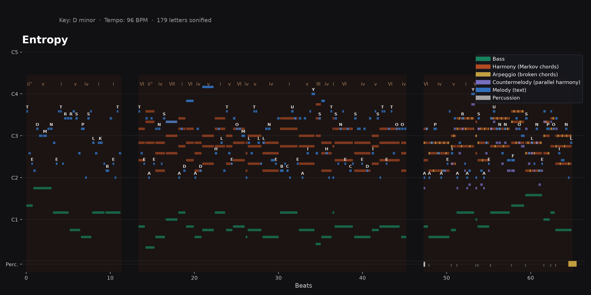

Idea ideated by Khaled Barakeh, developed and implemented by Fareed Barakeh.

# NeuroSonix

NeuroSonix turns alphabetic text into a full, playable musical composition
— pitch, rhythm, dynamics, and harmony, rendered straight to MIDI, to
audio, and to a picture of the score. No DAW, no soundfont, no manual
copy-pasting between scripts: one command in, a finished piece out.

The original 2024 prototype (kept below, in `Code/legacy/`) proved the
core idea — that a sentence typed by hand could become a melody — but it
was a handful of disconnected scripts glued together by hand, each one
saving to a hardcoded path on the Desktop. This is a rewrite: one real
package, `neurosonix/`, with an honest account of what's rule-based, what's
statistical, and what's audio DSP — see [What's actually inside](#whats-actually-inside)
below, since the original README overstated the AI involved.

## Listen — and play

**[Open the interactive player](outputs/player.html)** — a browser page (no
install, no server) that plays any of the three demo pieces back with a
synced, animated piano roll and the source text highlighted letter by
letter as it sounds, karaoke-style.

Three demonstration pieces, all fully arranged (see
[Advanced arrangement](#advanced-arrangement) below) and in [`outputs/`](outputs/),
generated straight from the text files in [`examples/`](examples/):

| Piece | Text | Scale | Listen |
|---|---|---|---|
| `manifesto` | [`examples/manifesto.txt`](examples/manifesto.txt) — a short statement of what this project is | D minor, chromatic melody (default) | [outputs/manifesto.mp3](outputs/manifesto.mp3) |
| `entropy` | [`examples/entropy.txt`](examples/entropy.txt) — on how rare letters get emphasized | D minor, tonal melody (`--tonal`) | [outputs/entropy.mp3](outputs/entropy.mp3) |
| `modulation` | [`examples/modulation.txt`](examples/modulation.txt) — on how the same words read differently depending on the scale they're heard in | D, six modes in sequence (`--modulate`, see below) | [outputs/modulation.mp3](outputs/modulation.mp3) |

Each also has a `.mid` (open it in any DAW or notation program), a `.wav`
(the same audio, uncompressed), a `.png` piano roll, and a `.web.json` (the
data the interactive player reads).



## Quick start

```bash
pip install -r requirements.txt

python -m neurosonix compose "Some text to sonify." --out outputs/mine --key Am --tempo 100
# -> outputs/mine.mid, outputs/mine.wav, outputs/mine.png, outputs/mine.json, outputs/mine.web.json

python -m neurosonix compose "Some text." --out outputs/mine --arrange --tonal
# -> the same, plus a countermelody, arpeggio, and percussion layer (--arrange),
#    with the melody snapped onto the chosen scale instead of staying chromatic (--tonal)

python -m neurosonix compose "Some text." --out outputs/mine --arrange --tonal \
  --modulate dorian,phrygian,aeolian,mixolydian,lydian,ionian
# -> cycles the harmony (and melody, since --tonal) through those six modes,
#    one per sentence, sharing --key's tonic (modal interchange)

python -m neurosonix batch examples/ --out outputs/ --arrange
# -> sonifies every .txt file in examples/, and refreshes outputs/neurosonix-data.js
#    (the bundle outputs/player.html reads)
```

Or from Python directly:

```python
from neurosonix.compose import compose
from neurosonix.harmony import Key
from neurosonix import render_midi, synth, visualize

score = compose("Some text to sonify.", tempo_bpm=100, key=Key(tonic_pc=9, mode='minor'))  # A minor
render_midi.save(score, "out.mid")
synth.save(score, "out.wav")
visualize.plot(score, out_path="out.png")
```

## How it works

```
Text
 │  encoding.py    — A-Z mapped to 26 consecutive chromatic semitones,
 ▼                    A = C2 through Z = C#4 (the original NeuroSonix rule,
 │                    unchanged since 2024's A Missing Camera)
Pitch
 │  rhythm.py       — each letter's duration comes from its Shannon
 ▼                    self-information under standard English letter
 │                    frequencies: common letters (E, T, A) are quick,
 │                    rare ones (Q, X, Z, J) land as long, weighted notes
Rhythm
 │  dynamics.py     — velocity follows a rise-and-settle arc across each
 ▼                    sentence, with accents on word starts and uppercase
 │                    letters, and a distinct gesture per terminator (. ! ?)
Dynamics
 │  harmony.py      — a hand-authored Markov chain over the seven diatonic
 ▼                    triads of the chosen key, reweighted at each step by
 │                    how well each candidate chord fits the melody note
 │                    sounding at that moment
Harmony
 │  render_midi.py  — three-track MIDI (melody / harmony / bass), General
 ▼                    MIDI instruments, exact ticks from a shared beat clock
 │  synth.py        — the same beat clock rendered directly to a mixed,
 ▼                    reverberant master (see Instrumentation & mix below)
 │                    — nothing here needs an external soundfont
 │  visualize.py    — a piano-roll picture of the same data, letters and
 ▼                    chord names printed on the notes
MIDI + Audio + Picture
```

`compose.py` runs the whole chain and returns one `Score` object; `render_midi.py`,
`synth.py`, `visualize.py`, and `web_export.py` all read from that same
object, so the MIDI file, the audio, the picture, and the interactive
player can never drift out of sync with each other.

## Advanced arrangement

`compose()` alone produces three tracks: melody, a harmony pad, and bass.
`--arrange` (or `neurosonix.arrange.progressive_arrangement()` from Python)
runs a second pass over that same `Score` that applies four classic
arranging techniques, in order — this is the actual step-by-step technique,
not just a one-line flag:

1. **Harmonize the melody** — `add_countermelody()`. A second melodic line
   in parallel harmony with the lead, a third below, sounding only on
   accented notes (word starts, uppercase letters) so it reads as emphasis
   rather than a doubled line. This is the oldest harmonization trick
   there is: parallel thirds and sixths, the backbone of close vocal
   harmony.
2. **Break the chords into motion** — `add_arpeggio()`. The harmony pad is
   static, sustained chords; this rolls each one into a
   root-third-fifth-third arpeggio at a 16th-note subdivision, so the
   harmony has rhythmic life instead of just sitting under the melody.
3. **Add a pulse** — `add_percussion()`. A minimal rhythm-section layer: a
   soft tick on every word, a stronger hit on every sentence, a crash on
   the final phrase.
4. **Stage the entrances** — `progressive_arrangement()`. The technique
   that actually makes an arrangement feel like it goes somewhere: layers
   1-3 don't all play from bar one. The piece opens with just melody and
   bass, the harmony pad enters at the second sentence, the countermelody
   and arpeggio at the third, and percussion only for the final phrase —
   the same build shape film scores and electronic production both lean
   on.

Each of the four functions returns a *new* `Score`; none of them mutate
`compose()`'s output, so the plain 3-track piece is always still available
by simply not calling `arrange`.

A related, separate knob: melody pitch is chromatic by default (see
[the pitch encoding](#how-it-works) above) — deliberately, since that
friction against the diatonic harmony is the original piece's character,
not a flaw to fix. `--tonal` (`compose(..., tonal=True)`) is the opt-in
alternative: `harmony.snap_to_scale()` pulls every melody note onto its
active scale, same rhythm and contour, fully consonant with the chords
underneath. `entropy` above uses it; `manifesto` doesn't, so the two
pieces show both.

One correctness note from building this: naively chaining "move each chord
voice to the nearest instance of its next pitch class" chord after chord
gives smooth *local* voice leading, but with nothing pulling a voice back
toward its home register, it can drift a bass line steadily downward over
a long piece with no bound. `harmony.bounded_nearest_pitch()` anchors each
voice to its fixed home-octave position and caps how far a step is allowed
to wander from it, keeping the smooth motion without the drift.

## Harmonic sophistication

Three more things separate a plain Markov-sampled triad progression from
something that reads as composed:

- **Extended chords.** Every chord can pick up a 7th (`harmony.chord_tones(...,
  seventh=True)`), with the probability weighted by function — the
  dominant (V) favors it most (60%; a dominant seventh's pull toward the
  tonic is stronger than the bare triad), ii next (30%, the jazz
  ii7-V7-I color), the rest more sparingly. A cadential arrival never
  gets one — a phrase's landing chord stays a plain triad, which reads
  more resolved without a 7th coloring it.
- **Real cadences.** Every sentence's harmony is pulled toward actually
  *landing* somewhere at its end, not wandering forever: a period or
  exclamation point resolves to the tonic (an authentic cadence, V/vii°→I),
  a question mark resolves to the dominant instead (a half cadence — the
  harmony leaves the sentence hanging in the air the way the punctuation
  does). This is a strong pull (`harmony.CADENCE_BOOST`), not an absolute
  rule, so an occasional deceptive cadence can still happen — about
  85-90% of sentences land exactly on target, the rest resolve elsewhere,
  the way a real progression sometimes surprises you.
- **Walking bass.** A chord held long enough (`compose.WALKING_BASS_MIN_BEATS`)
  hands its last third to a passing tone approaching the *next* chord's
  root by a half step, instead of sustaining one note for the whole
  chord — what a bassist playing live actually does between chords,
  visible in the piano roll as a staircase instead of a series of flat
  blocks.

## Scales and modulation

`harmony.Key` isn't limited to major/minor — it supports all seven
diatonic modes (`ionian`/`major`, `dorian`, `phrygian`, `lydian`,
`mixolydian`, `aeolian`/`minor`, `locrian`), and chord quality (whether a
roman numeral prints upper-case, lower-case, or gets a `°`/`+`) is
computed from each triad's actual intervals rather than looked up from a
fixed major/minor table — so it's correct automatically for any mode, not
just the two everyone already had covered.

`--modulate dorian,mixolydian,lydian,aeolian` (or
`compose(..., modulate=[...])` with a list of `Key`s from Python) cycles
the harmony through those modes one per sentence, instead of staying in a
single scale for the whole piece. Given `--key`, every mode in the list
shares its tonic pitch class — this is modal interchange (D dorian → D
mixolydian → D aeolian: the "D" stays fixed, only the color around it
shifts), not a full key change every sentence, which is what keeps a
modulating piece sounding like one continuous idea instead of six
unrelated fragments stitched together. With `--tonal` on too, the melody
modulates right along with the harmony. `modulation` above cycles through
all six non-locrian modes across its six sentences; both the piano roll
and the interactive player mark every scale change with a dashed line and
the new key's name.

The Markov chain's state (which scale degree the harmony is "on") carries
straight across a modulation: finishing a phrase on the 5th degree of the
old mode and landing on the 5th degree of the new one reads as a
pivot-chord-like transition rather than a hard cut, because scale-degree
function is preserved even though the pitches underneath just moved.

## Instrumentation & mix

The first version of `synth.py` was correct but mechanical: a MIDI note
converted straight into a sine-harmonic stack with an ADSR envelope, dry,
in tune, exactly on the beat, every note re-attacking from silence.
That's what a sequencer produces before anyone plays or produces it.
`synth.py` has since gone through two more passes: one for performance
realism (legato, breath, humanized timing), and a second, deliberately
**dreamy** pass — softer attacks, longer tails, an echo, a bigger and
darker reverb — that also pulled back or removed the noisier elements
(a clicking hi-hat, breath hiss, aggressive bass drive) in favor of
letting melodic lines linger into their own silences.

**Per-note realism:**

- **Vibrato** on the melody and countermelody, fading in over the first
  ~150-220ms of a held note rather than present from the attack, with its
  rate and phase wobbling slightly per note — a real vibrato isn't a
  perfectly periodic oscillator, and it doesn't start wobbling on note one.
- **Brightness follows velocity.** A loud note's upper harmonics carry
  more relative energy; a quiet one is rounder and darker. A fixed
  harmonic mix at every dynamic is one of the more obvious "sequenced" tells.
- **Tremolo**: a slow amplitude drift on sustained voices (the pad most
  of all) so a long note breathes instead of sitting at a dead-flat level.
- **Unison detune (chorus) on every pitched voice**, not just the pad —
  the harmony pad now spreads across 4 voices (±3/±9 cents) for a lusher
  wash, and the melody, countermelody, and arpeggio all got their own
  gentle detune where they had none before. Perfectly in-tune oscillators
  sound thin and static; a few cents of spread between unison voices is
  most of what "dreamy" actually sounds like.
- **Drive** (soft `tanh` saturation) on the bass, pulled back to a gentle
  amount for warmth without the earlier version's edge.

**Performance and phrasing:**

- **Note stretch (rubato).** A melody or countermelody note that *isn't*
  followed closely by the next one (`synth.STRETCH_VOICES`,
  `synth.STRETCH_MAX_S`) gets to ring on into the quiet that follows it
  instead of stopping dead at its nominal duration — a held, lingering
  quality rather than a fixed note length, randomized per note so it
  doesn't stretch identically every time.
- **Legato / portamento.** When melody, countermelody, or bass notes land
  back-to-back with almost no gap (`synth.LEGATO_GAP_S`) — the *other*
  case, when the next note is close rather than far — the second note
  glides up from the first note's pitch instead of re-attacking from
  silence. This is what the walking bass (see Harmonic sophistication)
  actually sounds like in the render: the passing tone glides into the
  next chord's root.
- **Humanization**: every note's start time gets a few milliseconds of
  jitter and its velocity a few percent, at render time only — the MIDI
  file stays exactly quantized, since that's the notation someone would
  open in a DAW, but the audio gets the timing looseness of something
  played rather than sequenced. Deterministic per note (seeded from the
  voice, index, beat, and pitch), so re-rendering the same `Score` reproduces
  the same take.

**Space:**

- **Reverb**: an 8-comb/4-allpass algorithmic reverb (the Freeverb design,
  implemented with `scipy.signal.lfilter` so the whole tail renders in a
  handful of calls instead of a Python loop over every sample), tuned
  larger and darker (`room_size=0.90`, `damping=0.55`) than a plain room,
  with a short pre-delay (`reverb_predelay_s`) so the dry attack stays
  clear before the wash arrives, gluing the voices into one shared space.
  Only the send gets a 2nd-order Butterworth high-pass (`_highpass`,
  240Hz) before it hits the comb bank — never the dry signal — so the
  bass's own fundamental doesn't get smeared into a low-frequency wash.
- **Echo**: a tempo-synced (dotted-eighth, `echo_beats=0.75`) feedback
  delay, darkening with each repeat (also high-pass filtered on its send,
  220Hz, for the same reason). A literal long-lag IIR filter here
  would cost O(samples × delay-in-samples) and take minutes on a full
  piece; `synth._echo()` instead sums a handful of shifted, progressively
  filtered copies of the signal, which is mathematically the same result
  for the *undamped* case and close enough for the damped one, at a
  fraction of the cost.
- **Master bus glue**: a gentle soft-knee compressor ahead of the final
  peak-safe normalize, instead of just scaling everything to the loudest
  sample in the piece.
- **Kept it clean**: the wet mix is deliberately modest (`reverb_wet=0.17`,
  `echo_wet=0.09`, down from an earlier, washier pass) because most of
  what read as "noisy" wasn't the reverb/echo itself — a full-spectrum
  flatness check showed the signal was already tonal, not broadband-noisy
  — it was that the reverb/echo sends are a minority of the mix's total
  energy next to the always-present dry notes, so no amount of send
  filtering moves the overall balance much. The bigger levers turned out
  to be the dry mix itself: less wetness outright, the bass's saturation
  drive pulled back, and the arpeggio's unison chorus narrowed (three detuned voices → two,
  `[-6, 0, 6]` → `[-4, 4]`, less beating/roughness) — together dropping
  the sub-250Hz share of total spectral energy from roughly 80% to the
  low 60s on all three demo pieces.

- **The actual bug underneath the noise, found afterward**: `synth._adsr`
  built attack+decay+release as *absolute* times, independent of how long
  the note actually was — so a note shorter than that sum still took the
  voice's full envelope regardless, and it's that oversized buffer (not
  the note's nominal duration) that gets pasted into the timeline. Harmless
  for a long-held note, but the pad and bass timbres have long tails
  (attack+decay+release sums to 1.62s for the pad, 0.40s for the bass) and
  this system deliberately gives almost every voice short, syllable-length
  notes — one chord per *word*, letters as short as a 16th note. Checked
  against the manifesto piece: 100% of melody notes, 94% of harmony-pad
  notes, and over a third of bass notes were shorter than their voice's
  fixed envelope, meaning nearly the whole piece was overhanging into the
  next one to three notes by anywhere from a few hundred ms up to a full
  second — two different pitches beating against each other, concentrated
  in the low end since that's both where the longest-tailed timbres (pad,
  bass) live and the register a listener's ear fuses two clashing pitches
  least forgivingly in. `_adsr` now compresses attack/decay to fit inside
  the note when they don't already, and caps release to roughly the note's
  own length instead of a fixed absolute value — a short note's overhang
  now scales with the note (tens of ms) instead of sitting at a constant
  regardless of it (hundreds of ms to over a second).

- **A second, low-note-specific bug, found after that**: the walking
  bass's passing tone (`compose.py`'s chromatic approach to the next
  chord's root) used plain `harmony.nearest_pitch()` instead of the
  register-anchored `bounded_nearest_pitch()` every other bass note goes
  through, so a downward chromatic approach could occasionally undercut
  the bass's intended floor by up to another 6 semitones — observed: a
  MIDI 13 note, 17.3Hz, below the master high-pass's own cutoff and at
  the edge of audibility, an unbounded rumble rather than a bass note. Now
  bounded the same way as every other bass note (floor: MIDI 15, ~29Hz).
  The bass timbre itself was also purified further while chasing this:
  `drive` (a tanh saturation stage) removed entirely — measured THD
  impact at the levels it was actually set to (0.5-0.9) turned out to be
  negligible, so it was adding risk of nonlinear grit for no real
  warmth — and its harmonic content thinned (`[1.0, 0.15, 0.04]` →
  `[1.0, 0.09, 0.02]`) for a rounder, purer low end. The master high-pass
  was also moved down from 28Hz to 18Hz: 28Hz sat close enough to the
  bass's own lowest note to put that note partly in the filter's own
  transition band rather than cleanly clear of it.

- **A third, and the actual root cause**: `LEGATO_VOICES` included `bass`.
  Each voice's notes render as independent buffers additively summed into
  the timeline (`render()`), so when two bass notes land close together, a
  legato/portamento glide starts the *new* note's pitch sweep at the
  *previous* note's own frequency — while that previous note's buffer is
  still sounding its release tail at that same frequency. For a window of
  tens of ms you get two overlapping, near-identical bass tones slowly
  diverging in pitch: textbook beating, an audible warble rather than a
  clean transition — and it lands on bass specifically because that
  register has the least other content to mask it under. `bass` is no
  longer a legato voice: every bass note now attacks cleanly at its own
  pitch instead of gliding from whatever the previous note is still
  ringing at. (`melody`/`countermelody` keep portamento — they sit in a
  busier, more masked part of the mix, where it reads as smoothness
  rather than beating.)

- **Fourth pass: replaced the instrument, not another bug fix.** Every
  prior fix was real and individually verified, and the complaint kept
  recurring anyway — at that point the more honest move was to stop
  hunting for a fifth specific mechanism and instead cut the bass down to
  the simplest possible instrument, so there's nothing left in its own
  signal chain that could be the culprit. `harmonics` is now `[1.0]` — a
  plain sine, not even a second or third partial — and `tremolo_depth` is
  0 (it had been a slow, small amplitude wobble; removed rather than
  argued for). Beyond the timbre itself, the bass now renders on its own
  bus and is summed into the mix *after* the reverb/echo send instead of
  before it (`render()`'s `bass_left`/`bass_right`), so it's not just
  high-pass-filtered out of the wet path like every other voice's send —
  it never reaches the reverb or echo at all, zero send contribution,
  zero chance of comb-filter or feedback-delay coloration on the low end.

- **Fifth pass, and the one that actually explains why nothing else
  worked**: `_soft_compress`, the master-bus "compressor," computed its
  gain reduction directly from each sample's own instantaneous magnitude
  — no attack, no release, no time constant of any kind. Applying a gain
  curve to a waveform sample-by-sample like that isn't compression, it's
  a static waveshaper (the same category of thing as the `tanh` `drive`
  already pulled off the bass, just sitting one stage later, on the
  master bus, after every voice's own signal chain). Measured: a clean
  bass sine loud enough to cross the 0.55 threshold came out the other
  side with 6-15% THD, entirely generated by this one stage. This is why
  every earlier bass-specific fix — timbre, envelope, register bound,
  legato, even replacing the instrument outright — left the complaint
  unmoved: they were all upstream of the actual distortion source.
  `_soft_compress` now runs its gain off a smoothed level envelope (a
  15ms one-pole follower) instead of the raw sample value, so gain
  changes across many cycles, tracking a note's overall loudness, instead
  of reshaping every individual cycle. Re-measured the same isolated
  bass sine after the fix: THD at a typical mix level dropped from 6.4%
  to 0%, and even a hard-driven test case (well above anything this
  system would actually feed it) dropped from ~14% to ~3%.

**Removed or pulled back, on purpose:** the per-word hi-hat tick is gone
entirely (a rhythm-section device, not an atmosphere), replaced with a
sparse soft chime marking only where a new sentence begins (see
`arrange.add_percussion`); the closing crash is now a slowly-decaying
inharmonic bell/gong shimmer (`synth._render_drum`, mostly tuned sine
partials with only a faint, heavily smoothed noise layer underneath) —
more melodic and far less noisy than the crash-cymbal noise burst it
replaced; and breath noise on melody/countermelody attacks, present in
the previous pass, is off by default now (`breath=0` in every `TIMBRES`
entry) for a cleaner, less breathy texture.

One correctness bug caught in building the reverb, worth naming because
it's the kind of thing that's easy to miss by only reading the code: a
comb filter's DC gain is `1/(1-feedback)` — at a `room_size` around 0.83-0.90
that's roughly 6-10x, so the tiny DC bias an additive synth mix picks up
from short, asymmetrically-windowed sine bursts (a low bass note only a
few cycles long doesn't average to exactly zero) was coming out the other
side amplified into an audible ~4.7%-of-full-scale offset. Caught by
actually inspecting a rendered file's sample statistics, not by reading
the DSP code and reasoning it should be fine. Fixed with a standard
one-pole DC-blocking filter, applied both inside the reverb and once more
on the final master bus; verified back down to ~0.03%.

## What's actually inside

Worth being precise about, since the original README (below) named
TensorFlow and PyTorch, and neither is used anywhere in this codebase:

- **The pitch encoding is a fixed rule**, not learned: a lookup table, one
  semitone per letter.
- **Rhythm is a closed-form function** of a well-known information-theory
  quantity (letter self-information from published English letter
  frequencies) — not learned, not random.
- **Harmony is a Markov chain**: a 7×7 transition matrix over diatonic
  chords, hand-authored from ordinary functional-harmony tendencies (V
  resolves to I, ii favors V, and so on), sampled and reweighted by melody
  fit at each step, with a strong (not absolute) pull toward a cadence at
  each sentence's end. This is a real generative/statistical model — it
  is not a trained neural network, and there's no model file or training
  corpus in this repo. If a genuinely learned harmony model gets trained
  later, it belongs here as an alternative backend to `harmony.py`, not a
  rewrite of it.
- **Extended chords and walking bass are fixed rules**, not learned or
  generative: a chord's chance of picking up a 7th is a hand-set
  probability per scale degree; a walking-bass passing tone is always the
  chromatic step below the next chord's root.
- **Audio synthesis is deterministic DSP**: sine-harmonic additive
  synthesis with an ADSR envelope for pitched voices, noise/pitch-envelope
  synthesis for percussion, an algorithmic (Freeverb-style) reverb, and a
  soft-knee compressor on the master bus — not a sample library, not a
  neural vocoder. "Humanized" timing/velocity jitter is seeded pseudo-randomness,
  not a model of how a person actually plays.
- **The arrangement layer is rule-based arranging, not composition AI**:
  countermelody is a fixed parallel-third transposition, the arpeggio is a
  fixed broken-chord pattern, percussion follows a fixed word/sentence
  rule, and the "build" is staged by phrase index. Real techniques, hand-specified.

None of that makes the piece less real — a Markov chain reweighted by
melody fit is a genuine generative-music technique, and letter-entropy
rhythm is a legitimate sonification idea in its own right. It just isn't
deep learning, and this README won't claim it is.

## Automation

`python -m neurosonix batch <folder> --out <folder>` sonifies every `.txt`
file it finds — the batch-processing capability the original README
promised, now actually implemented.

## Project layout

```
neurosonix/        the current engine
  encoding.py         text -> chromatic pitch (the original rule)
  rhythm.py           letter-entropy -> note duration
  dynamics.py         sentence-arc -> velocity
  harmony.py          Markov chord progression + voice leading
  compose.py          orchestrates the four modules above into one Score
  arrange.py          the advanced-arrangement pass (see above)
  render_midi.py      Score -> .mid
  synth.py            Score -> .wav (built-in additive/noise synth)
  visualize.py        Score -> .png piano roll
  web_export.py       Score -> .web.json for outputs/player.html
  cli.py              `compose` / `batch` commands
examples/           input texts for the three demo pieces
outputs/            their rendered .mid / .wav / .mp3 / .png / .json /
                    .web.json, the data bundle, and player.html itself
Code/legacy/        the original 2024 prototype scripts, kept for history
Audio/ Midi/ Score/ Sheet/   the original "A Missing Camera" piece and its
                    finished audio, score, and sheet music
```

## Potential applications

Artistic sonification of written works, datasets, and archival material.
Cross-modal storytelling in exhibitions, immersive installations, and
interactive media. Algorithmic composition from textual inputs.
Accessibility tools for converting text into sound-based representations.
